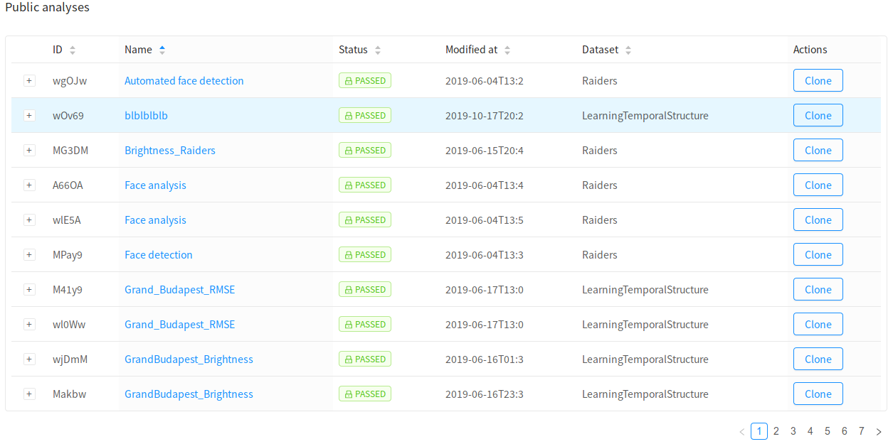

# Browsing analyses

Neuroscout lets you browse analyses you've created, as well as analyses that are publicly listed by other members of the community.

To browse analyses, select `My analyses` or `Public analyses` under `Browse` in the navigation bar. Sort by any column by clicking on it.

## Editing analyses

To launch the analysis builder, simply click the name of the analysis. Note that only analyses that are still in `DRAFT` mode (i.e. have not been submitted for bundle generation) are fully editable.
However, you can launch the analysis in "view-only" mode for any analysis, including public ones.

Remember that for your analyses, you can always change the `name`, `description` and `public/private` status.

!!! Note
    Instead of "editing" a `PASSED` analysis, you can use the [clone](clone.md) feature to make an editable copy.

## Deleting analyses

Similarly, only analyses that are still in `DRAFT` mode can be deleted. Simply click `Delete` in the right-most column.

However, remember that you can always make an analysis `private` at any time.
