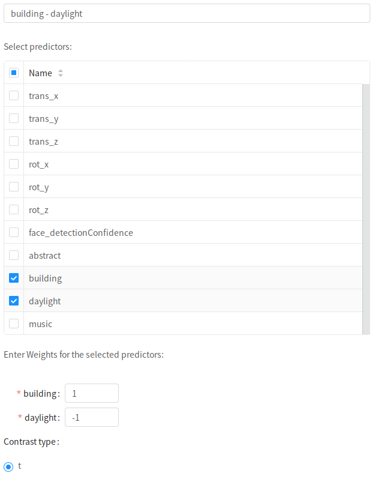

# Contrasts

In this tab, you can define contrasts to compute at the first-level after the design-matrix is fit to the fMRI activation time-course.

As there are often no experimental conditions in naturalistic studies, it often makes the most sense to simply propagate the individual estimates for each predictor of interest (e.g. non-confounds).

We can achieve this using "Dummy" auto-contrasts, in which each Predictor is given a dummy-coded contrast of the same name.

To do this for all non-confounds, simply click `Generate Auto Contrasts`.

!!! Note
    If you go back to the `Predictors` tab and edit the predictor list, you may have to re-generate auto contrasts.

## Defining a custom contrast

To define a contrast, click `Add Contrast`. First, you must give the contrast a name.
Next, select the predictors to include in this contrast. All predictors not selected will be given a weight of 0.
Finally, enter the weights for the selected predictors.

In this example, we are contrasting `building` and `daylight` using `t` contrast.

As in the transformations tab, you can re-order, trash, and edit existing contrasts.
