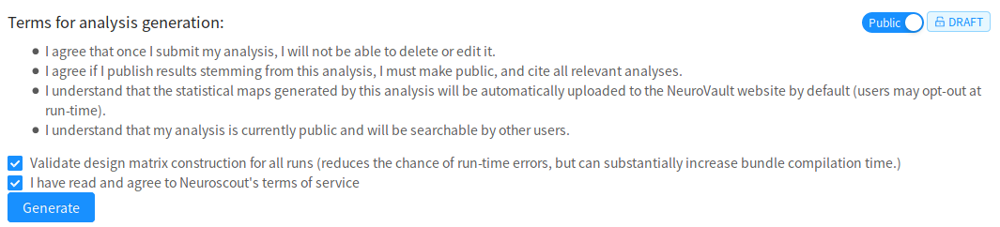

# Finalize and Run

After you've reviewed your analysis, you need to generate an executable analysis bundle prior to being able to execute it.

In the upper right you'll find a toggle that let's you switch from a public analysis (the default), to private.

_Public_ analyses are listed under "public analyses", and are searchable by other Neuroscout users.
_Private_ analyses do not show up in this listing, but be aware that any user with the analyses' `unique ID` can view this analysis.
You can use this to your advantage to share your analysis with your colleagues.

If you agree to the terms, click `Generate` to submit.

Be patient, analysis bundle generation may take a while.
If you're in a rush, and are willing to risk additional run-time errors, uncheck `Validate design matrix`.

# Status

After submitting your analysis, it will no longer be editable unless there is an error in your design that you must fix.

If your analysis successfully compiles, an example `neuroscout-cli` command will be shown.

For more information on how to execute an analysis, head over to the [neuroscout-cli](../cli/index.md) documentation.

!!! Note
    After your analysis is compiled, you can change the public/private settings of your analysis, as well as edit the `name` and `description`.
    Also, notice the `Review` tab is still available.
