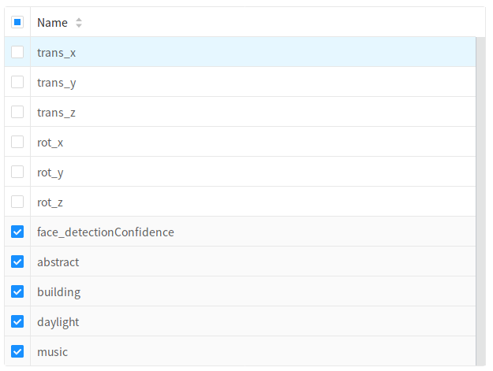
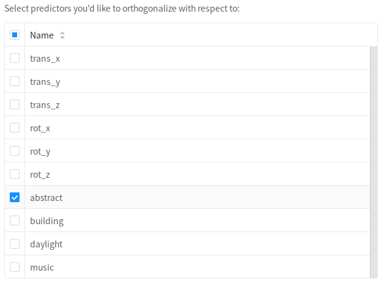

# Add Transformations

The next step in defining model is to transform the variables you've selected. This step is optional-- for many models you may not need to make any modifications to the input variables.

To add a transformation, click `Add Transformation` and select an operation from the dropdown list.

The transformations currently supported by Neuroscout are a subset of the complete set of transformations detailed in the [BIDS StatsModel specification](https://docs.google.com/document/d/1bq5eNDHTb6Nkx3WUiOBgKvLNnaa5OMcGtD0AZ9yms2M/edit?usp=sharing) (in active development). As Neuroscout matures, the number of suppport transformations will grow.

| Transformation      | Description                                                                                                                                |
|---------------------|--------------------------------------------------------------------------------------------------------------------------------------------|
| Scale               | Standardize the value of one or more variables. Can independently choose to denmean and/or rescale.                                        |
| Orthogonalize       | Orthogonalizes one or more input columns with respect to one or more other columns.                                                        |
| And/Or/Not          | Each of these transformations takes one or more columns, and performs a logical operation on the input column and a provided operand.      |

## Select input

For all transformation, you must select on which this transformation will operate.
Most operations will operate on each column independently, but specifying multiple columns will save you from having to specify the same operation for multiple predictors.

## Transformation-specific options
Most transformations additional have specific options which you can specify.

### Scale

  - Demean - If True, subtracts the mean from each input column (i.e., applies mean-centering).
  - Rescale - If True, divides each column by its standard deviation.
  - ReplaceNA - Whether/when to replace missing values with 0. "Don't replace"- no replacement is performed. If 'before', missing values are replaced with 0's before scaling. If 'after', missing values are replaced with 0 after scaling.

### Orthogonalize

- You must select the inputs to orthogonalize with respect to. The transformed variable will be uncorrelated to these variables.

### Threshold

- Threshold - The value to binarize around (values above will be assigned 1, values below will be assigned 0)
- Binarize -  If True, binarizes all non-zero values (i.e., every non-zero value will be set to 1).
- Above -  Specifies which values to retain with respect to the cut-off. If True, all value above the threshold will be kept; if False, all values below the threshold will be kept.
- Signed - Specifies whether to treat the threshold as signed (default) or unsigned. For example, when passing above=True and threshold=3, if signed=True, all and only values above +3 would be retained. If signed=False, all absolute values > 3 would be retained (i.e.,values in  the range -3 < X < 3 would be set to 0).

## Editing and order

It is important to note that transformations are applied sequentially, so the order of the transformation matters.
To re-order transformation you can drag and drop transformations in the list.

You can also remove transformations you've created using the trash icon, and edit existing transformations with the blue edit icon.
