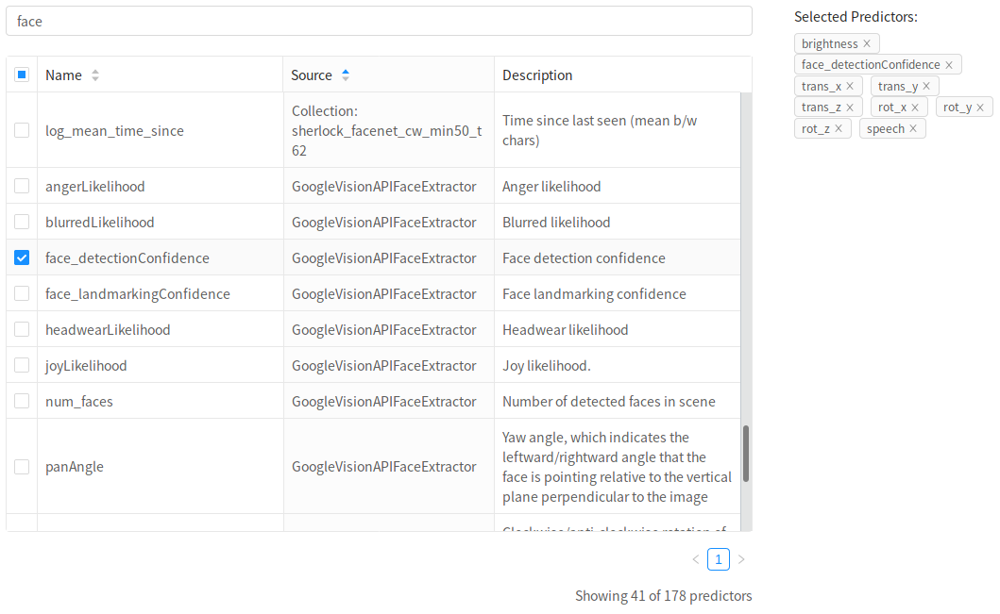

# Analysis Overview

When you create a new analysis, you'll launch the analysis builder. You'll sequentially advance through tabs in the builder as you define your analysis.
Later in the process, you can always go back to tabs that you've previously encountered, and make modifications.

The first step after creating a new analysis is to give it a `name`. This doesn't have to be a unique name (although that might be helpful), and you can always change it later.

Optionally, also give your analysis a `description`. If you make many analyses, this could be very helpful.

## Choosing a dataset

Neuroscout currently indexes a curated set of nine public naturalstic fMRI datasets.

Datasets were specifically chosen for their compliance to the BIDS standard, and availability of original naturalistic stimuli.
You can find detailed information on each dataset by clicking on the blue link icon.

All datasets are minimally preprocessed using `fmriprep` 1.2.2 or greater, and ready for model fitting.

If you have a dataset you'd like to contribute, see this [frequently asked question](../faq.md#i-have-a-naturalistic-study-id-like-to-share-on-neuroscout-how-do-i-do-so).

## Selecting task and runs

Once you've selected a dataset, you'll be able to choose which task and runs you want to analyze.

Currently, we only support analyzing one task at a time. By default, all runs for that task are selected.

If you want to select specific runs to analyze, either to only analyses a group of subjects, or to omit certain runs that might have a known issue, you can use the run selector interface.

Here you can browse and select specific runs.
If you'd like to select groups of runs based on their BIDS entities (e.g. `Subject`, `Run Number`, etc..), click on the filter icon at the top of each column. A drop down menu will appear, allowing you to make a selection. Click "OK" to apply this filter.

You can clear all filters and select all runs by clicking `Clear Filters` on the bottom left.

## Saving and unique ID

To save your nascent analysis, click on the "Save" button. If the button is blue, that means there are unsaved changes.

When you first save your analysis, it will be assigned a unique, permanent ID.

Note that when you advance through tabs in the builder, the analysis will be automatically saved.

Click on the `Next` button to advance to the `Predictors` selection tab.

# Select Predictors

In this tab, you can browse and search from hundreds automatically extracted predictors to include in your model.

Predictors each have a unique `Name`, and belong to a `Source`. They are also given a human readable `Description`.

In the above example, we have selected the `building` predictor, that has the source `ClarifaiAPIImageExtractor`.
This is an example of a predictor that was extracted from experimental stimuli. This predictor encodes the probability of a building in a given frame, according to the `Clarifai` Image Recognition API.

You can use the search bar to filter predictors across all three columns. For example, here we searched for "image recognition", resulting in 67 matches.

As you select predictors, they are displayed in the top right, helping you keep track of predictors not in the current search.
You can click on the `x` on the right of each label to unselect that predictor.

!!! Note
    The predictor interface is your sole interface for adding predictors to the design matrix, including "confounds".

    Since all datasets are pre-processed with `fmriprep`, use that as a search term to display available confounds. In this example, we have already selected six fmriprep confounds to include in the model (6 rigid-body transforms, such as `rot_x`).

    See the [fmriprep documentation](https://fmriprep.readthedocs.io/en/stable/outputs.html#confounds) for in-depth information about these confound variables.

!!! Danger
    Very large models with dozens of predictors may be slow to compile and fit. We recommend starting with smaller models and building up to larger models as you've gained experience.

# Add Transformations

The next step in defining model is to transform the variables you've selected. This step is optional-- for many models you may not need to make any modifications to the input variables.

To add a transformation, click `Add Transformation` and select an operation from the dropdown list.

The transformations currently supported by Neuroscout are a subset of the complete set of transformations detailed in the [BIDS StatsModel specification](https://docs.google.com/document/d/1bq5eNDHTb6Nkx3WUiOBgKvLNnaa5OMcGtD0AZ9yms2M/edit?usp=sharing) (in active development). As Neuroscout matures, the number of suppport transformations will grow.

| Transformation      | Description                                                                                                                                |
|---------------------|--------------------------------------------------------------------------------------------------------------------------------------------|
| Scale               | Standardize the value of one or more variables. Can independently choose to denmean and/or rescale.                                        |
| Orthogonalize       | Orthogonalizes one or more input columns with respect to one or more other columns.                                                        |
| And/Or/Not          | Each of these transformations takes one or more columns, and performs a logical operation on the input column and a provided operand.      |

## Select input

For all transformation, you must select on which this transformation will operate.
Most operations will operate on each column independently, but specifying multiple columns will save you from having to specify the same operation for multiple predictors.

## Transformation-specific options
Most transformations additional have specific options which you can specify.

### Scale

  - Demean - If True, subtracts the mean from each input column (i.e., applies mean-centering).
  - Rescale - If True, divides each column by its standard deviation.
  - ReplaceNA - Whether/when to replace missing values with 0. "Don't replace"- no replacement is performed. If 'before', missing values are replaced with 0's before scaling. If 'after', missing values are replaced with 0 after scaling.

### Orthogonalize

- You must select the inputs to orthogonalize with respect to. The transformed variable will be uncorrelated to these variables.

### Threshold

- Threshold - The value to binarize around (values above will be assigned 1, values below will be assigned 0)
- Binarize -  If True, binarizes all non-zero values (i.e., every non-zero value will be set to 1).
- Above -  Specifies which values to retain with respect to the cut-off. If True, all value above the threshold will be kept; if False, all values below the threshold will be kept.
- Signed - Specifies whether to treat the threshold as signed (default) or unsigned. For example, when passing above=True and threshold=3, if signed=True, all and only values above +3 would be retained. If signed=False, all absolute values > 3 would be retained (i.e.,values in  the range -3 < X < 3 would be set to 0).

## Transformation editing and order

It is important to note that transformations are applied sequentially, so the order of the transformation matters.
To re-order transformation you can drag and drop transformations in the list.

You can also remove transformations you've created using the trash icon, and edit existing transformations with the blue edit icon.

# HRF Convolution

In this tab, you can select which predictors you'd like to convolve with the canonical haemodynamic-response function (HRF).

Typically, you'll want to convolve all non-confounds. You can easily do this by clicking `Select All Non-Confounds`.

As in the `Predictors` tab, you can perform a full-text search over all the predictors you previously selected.

For now, we are applying a ["SPM" style](https://en.wikibooks.org/wiki/SPM/Haemodynamic_Response_Function) HRF, with no derivatives.

!!! Note
    In reality, HRF convolution is another transformation that is applied after all other transformations.
    Thus, the transformed variables will be the ones that are convolved.

# Contrasts

In this tab, you can define contrasts to compute at the first-level after the design-matrix is fit to the fMRI activation time-course.

As there are often no experimental conditions in naturalistic studies, it often makes the most sense to simply propagate the individual estimates for each predictor of interest (e.g. non-confounds).

We can achieve this using "Dummy" auto-contrasts, in which each Predictor is given a dummy-coded contrast of the same name.

To do this for all non-confounds, simply click `Generate Auto Contrasts`.

!!! Note
    If you go back to the `Predictors` tab and edit the predictor list, you may have to re-generate auto contrasts.

## Defining a custom contrast

To define a contrast, click `Add Contrast`. First, you must give the contrast a name.
Next, select the predictors to include in this contrast. All predictors not selected will be given a weight of 0.
Finally, enter the weights for the selected predictors.

In this example, we are contrasting `building` and `daylight` using `t` contrast.

As in the transformations tab, you can re-order, trash, and edit existing contrasts.

# Review

Once you have selected predictors, applied transformations, and defined your contrasts, you're ready to review the statistical model you've designed.

## Design Report

Upon reaching the `Review` tab, a report is requested from the Neuroscout server that will validate your analysis, apply transformations and pre-compute the design matrix to be fit to the fMRI data.
It may take a few minutes to receive the report.

### Design Matrix

Here you can interactively review the final design matrix that will be fit at the first-level of your analysis.
The top plot will give you an overview of the design matrix, with each column of the design matrix on the x-axis and time on the y-axis.

In the bottom plot, you can explore the predictor time courses in more detail. By clicking on the legend on the right, you can select specific predictors to plot. You may shift-click to select multiple predictors at once.

!!! Note
    For display purposes, each column is standardized prior to the creation of these plots, even if you did not request a `scale` transformation.
    This force re-scaling will not be performed when creating the actual design matrix.

### Correlation Matrix

The correlation matrix provides you can opportunity to review the covariance between your predictors.
Note that predictors that are highlight correlated with each other may result in a rank deficient design matrix which will cause model fitting to fail.

!!! Hint
    Hover over values in the plot to see the correlation r-values.

## Analysis Overview

Finally, a complete summary of your analysis is displayed in this tab. Here you can review all of the choices you've made and ensure you are happy with the analysis prior to continuing.

!!! Note
    Neuroscout stores your model design using BIDS Stats-Model, an in-development JSON standard for representing fMRI models.
    This is the true, final representation of your model, so if you are having problems, or would like to meticulously review your analysis, review this section.

# Run
